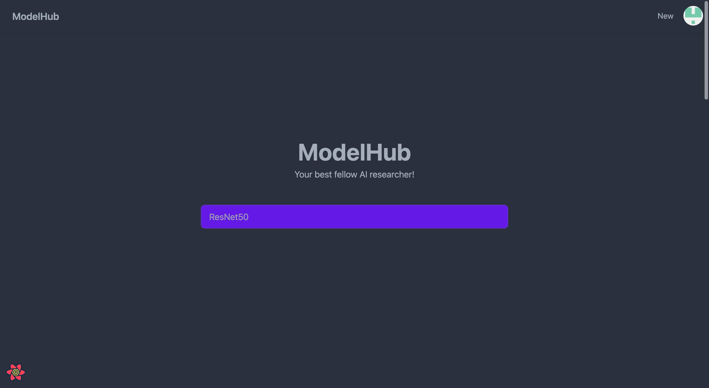
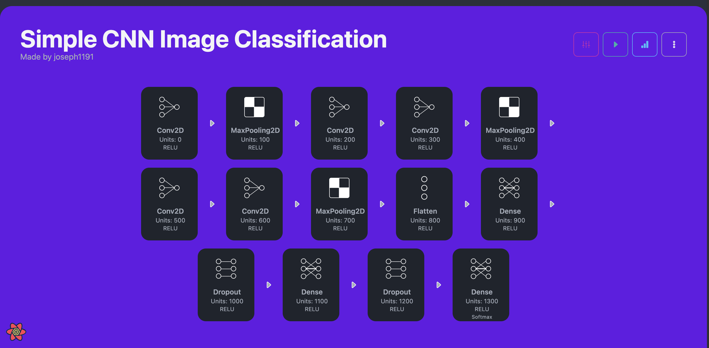

# ModelHub

[3rd PATHHACK : 쉬운 해커톤](https://event-us.kr/pathfinder/event/43523)에 AI 트랙으로 참여하여, 깃허브를 모티브로 AI 모델을 간단히 브라우징 할 수 있는 Modelhub를 개발함.

> [!NOTE]\
> See also: [junwha0511/modelhub](https://github.com/junwha0511/modelhub)

## Tech Stack

- Next.js
- DaisyUI
- TailwindCSS

## Showcase

## Project Overview

본 프로젝트는 "AI 모델을 시작적으로 구현하고, 이를 플랫폼에 공유하며, 플랫폼에서 학습 및 테스트까지 할 수 있는 것이 있다면 좋지 않을까?" 하는 아이디어에서 시작했다. 이에 대한 프로토타입의 일환으로, 깃허브를 모티브로 AI 모델을 간단히 브라우징 할 수 있는 Modelhub를 개발하였다.

본 프로젝트에서 프로토타이핑된 기능은 아래와 같다.

- AI 모델을 브라우징 할 수 있는 기능
- 이미 업로드 되어있는 모델의 하이퍼파라미터를 수정할 수 있는 기능
- 모델을 학습시킬 수 있는 기능
- 학습된 모델을 테스트 할 수 있는 기능

## Caveats

- 본 프로젝트는 본래 AWS Amplify로 개발될 예정이었으나, Amplify를 도입하는 것에 꽤 Steep한 러닝 커브가 있는 것을 뒤늦게 깨달았고 빠르게 간단한 Flask 서버와 Mock 데이터로 대체해 프로토타이핑을 진행하였다.

## Achievements

- 3rd PATHHACK : 쉬운 해커톤 스폰서상
